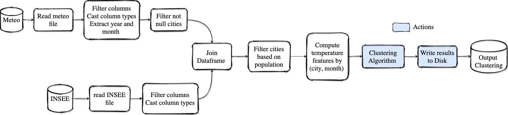

## Installation 

```bash
git clone https://gitlab.com/simon.grah/spark_optimization.git
pip install .
```

## Dataset sources
* [Meteo Dataset](https://public.opendatasoft.com/explore/dataset/donnees-synop-essentielles-omm/table/?sort=date&dataChart=eyJxdWVyaWVzIjpbeyJjaGFydHMiOlt7InR5cGUiOiJjb2x1bW4iLCJmdW5jIjoiQVZHIiwieUF4aXMiOiJ0YyIsInNjaWVudGlmaWNEaXNwbGF5Ijp0cnVlLCJjb2xvciI6IiNGRjUxNUEifV0sInhBeGlzIjoiZGF0ZSIsIm1heHBvaW50cyI6IiIsInRpbWVzY2FsZSI6ImRheSIsInNvcnQiOiIiLCJjb25maWciOnsiZGF0YXNldCI6ImRvbm5lZXMtc3lub3AtZXNzZW50aWVsbGVzLW9tbSIsIm9wdGlvbnMiOnsicS50aW1lcmFuZ2UuZGF0ZSI6ImRhdGU6WzE5OTktMTItMzFUMjM6MDA6MDBaIFRPIDIwMjEtMDMtMDFUMjI6NTk6NTlaXSIsInNvcnQiOiJkYXRlIn19fV0sImRpc3BsYXlMZWdlbmQiOnRydWUsImFsaWduTW9udGgiOnRydWV9&location=3,17.30869,2.63672&basemap=jawg.streets)
* [Insee Dataset](https://www.data.gouv.fr/fr/datasets/data-insee-sur-les-communes/)

## Toy example pipeline



